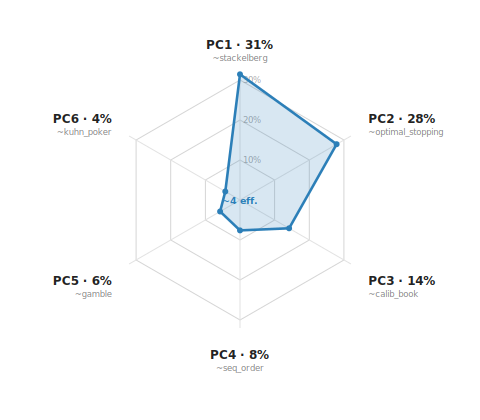

# AERead — results so far

AERead asks a deployment question — *is this agent ready to act in the economy without bleeding value to an adversary?* — and answers it through a single, exact channel: **exploitability**. Fix a model's revealed strategy in a decision problem with a hand-specified, closed-form oracle; the exploitability is the surplus an *optimal* adversary extracts by best-responding to it. **Lower is better; 0 means perfectly coherent — no optimal opponent (RL, another LLM, or human) can take anything.** Four results cut across the sections below: (1) the most strategically *informed* Opus version regressed on Kuhn poker — exploitability jumped from a flat 0.11 across 4.5/4.6/4.7 to **0.28** at 4.8, and the newest GPT-5.5 and Gemini-3.5-flash land on the *identical* sub-optimal play (a cross-lab pattern) — a scalar average hides it while a per-game decomposition localizes it to a single decision node; (2) the deepest, most universal failure is that LLMs cannot self-randomize, an *architectural* deficit that a strategy/realization split fixes outright, leaving a residual that is equilibrium *computation*, not entropy; (3) framing-invariance and most per-decision competence are *solved* at the frontier; and (4) exact single-agent store-sims all **saturate** — a falsifiable boundary showing that long-horizon agentic coherence is structurally incompatible with an exact decomposable oracle.

---

## What we measure & how

**Summary.** Every AERead exact-channel result is one number computed the same way: pin down what the model *does* (from realized behavior, not its self-report), then compute exactly how much an optimal adversary extracts from that behavior. The number is `e = V_BR(p) − v*` — best-response value minus the game's unexploitable reference value — normalized to [0,1]. It is `≥ 0` and `= 0` only when the strategy is unexploitable. This is a *defensive*, distribution-free measure (the worst any optimal opponent can do to you), the dual of the offensive framing in [TERMS-Bench](terms-bench.html) (the best an agent can do against a fixed opponent).

The methodology spine — what makes a result *certifiable* rather than merely measured — has five disciplines, detailed in [exploitation foundations](../exploitation_foundations.html) and [oracle choice](oracle-choice.html):

- **Exact, hand-specified oracle (never learned).** The payoff matrix `A` is both the case definition and the scorer; it is never a learned reward or an LLM judge. This is the **OracleDecomposable** requirement — replacing `A` with a learned judge reintroduces the judge-confound. The reference value `v*` is known *analytically before measurement* (0 for symmetric zero-sum, `1/18` for Kuhn) — predict-then-validate, not fit-after-the-fact.
- **Three oracle families, chosen by what each requires** ([oracle choice](oracle-choice.html)): **(1) worst-case / best-response** — needs a payoff matrix and an adversary, no prior, gives a distribution-free defensive guarantee (the default for matrix games, Kuhn, gambles); **(2) average-case / Bayesian** — needs a fixed prior, gives deployment-realistic regret, the [TERMS-Bench](terms-bench.html) regime; **(3) self-consistency / money-pump** — needs neither prior nor adversary, scores guaranteed self-arbitrage, the conflict-free spine preferred wherever a dimension can be framed as no-arbitrage. Family (3) is parameter-free and the most robust to a normative-standard objection — no reviewer can say "*my* preference rationalizes the loss" — because the no-arbitrage standard is not a substantive objective; families (1)–(2) embed a substantive objective and are exposed as a *swappable parameter*. For dimensions where rational standards genuinely conflict (Ellsberg ambiguity, risk attitude, discounting horizon), AERead reports a *characterization under a named standard*, never a "failure."
- **De-leading.** The prompt describes the mechanism but never names the bias, method, or objective; each `elicit()` is checked against a forbidden-word list (e.g. `vickrey` forbids `truthful/dominant/strategyproof/incentive/equilibrium`). We elicit the leak, we don't instruct around it.
- **Per-instance regeneration (contamination resistance).** Each case is parametrized by `make(seed)`; the eval averages over distinct seeds (`N_NEW`=8–10), recomputing the oracle per instance, so a memorized answer to one seed does not transfer. Structural variety is itself asserted (e.g. ≥2 distinct oracle labels, both horizons, >20 distinct values across the panel).
- **A generation gate.** A case is admitted only if it passes four legs: an exact oracle (`exploitability(oracle(instance)) ≤ 1e-9`), beats-random (`random_baseline > 0.1`, so a uniform agent is measurably exploitable), discriminates (measured cross-model std), and de-leads. Cases run as `__main__` and print `CASE READY` only if all assertions pass.

The exactness comes from *where the channel lives* on the solvability ladder ([games by solvability](games-by-solvability.html)): almost the entire suite is **L0** (one-shot normal-form, exact via LP over the simplex) and **L2-small** (imperfect-info, perfect-recall, small — exact game tree; Kuhn is here). That is why the numbers are exact rather than lower bounds. Larger imperfect-info games (L2-large) carry a CFR certificate (`exploitability(σ̄) ≤ R/T → 0` in two-player zero-sum); genuinely non-MDP problems (L3) admit only RL lower bounds and are kept out by construction.

---

## Leaderboard

**Summary.** Eight frontier-class models, ranked by mean exploitability across the **five fair discriminating axes** (**lower = better**). "Fair" means the randomization axis uses the **external-RNG** measure: the model only *states a distribution* and a real RNG realizes the moves, so we never penalize it for being unable to self-randomize (an architecturally-fixable deficit — see Finding 2). Under external RNG, plain `rps` is **0.000 for every model** (uniform is the equilibrium, trivially known), so it carries no information and is dropped; the randomization family is represented by **eq-computation** = weighted-RPS distribution exploitability (a sampler can't fix stating the *wrong* mixture). The mean blends full-sampled cells with the two † lighter-sampled models, so positions #2 and #5 are provisional pending a full re-run.

| # | model | mean ↓ | `eq-comp` | `kuhn` | `intertemporal` | `cross-mod` | `allais` |
|---|---|---|---|---|---|---|---|
| 1 | grok-4.3 | **0.022** | 0.000 | 0.111 | 0.000 | 0.000 | 0.000 |
| 2 | **gpt-5.5** † | 0.056 | 0.000 | **0.278** | 0.000 | 0.000 | 0.000 |
| 3 | claude-sonnet-4.6 | 0.058 | 0.131 | 0.111 | 0.048 | 0.000 | 0.000 |
| 4 | claude-opus-4.8 | 0.088 | 0.139 | **0.278** | 0.024 | 0.000 | 0.000 |
| 5 | **gemini-3.5-flash** † | 0.136 | 0.140 | **0.278** | 0.264 | 0.000 | 0.000 |
| 6 | claude-opus-4.5 | 0.170 | 0.093 | 0.111 | 0.645 | 0.000 | 0.000 |
| 7 | gpt-5.1 | 0.245 | 0.129 | 0.444 | 0.026 | 0.000 | 0.625 |
| 8 | gemini-2.5-flash | 0.332 | 0.077 | 0.111 | 0.720 | 0.750 | 0.000 |

*`eq-comp` is the external-RNG distribution exploitability on weighted-RPS (best of 2 paraphrases, mean of three weightings), measured for all 8 models. † gpt-5.5 and gemini-3.5-flash had `kuhn`/`intertemporal` measured with lighter sampling (N=32, K=1, 4 seeds). The two universal-ceiling cases (`ellsberg`, `cyclic7`) and the saturated-floor cases are excluded — they are ~equal for every frontier model and don't move the ranking.*

**The fair measure re-ranks the board.** Dropping the (fixable) entropy penalty and scoring only *stated* mixtures, **grok-4.3 and gpt-5.5 lead** — they are the only two models that actually **compute the skewed weighted-RPS equilibrium** (eq-comp 0.000), where opus-4.8/sonnet-4.6/gemini-3.5-flash default toward uniform (≈ 0.13–0.14). On the old "LLM-as-RNG" measure gpt-5.5 looked mid-pack on randomization; fairly measured it is at the top. *(Provisional: gpt-5.5 and gemini-3.5-flash use the lighter † sampling and eq-comp is best-of-2-paraphrases × 3 weightings, so the exact rank order among the leaders is soft — the robust signal is the qualitative split: two models compute the skewed equilibrium, the rest default to uniform.)*

**Cross-lab convergence on one exact failure.** The three newest-generation models — **claude-opus-4.8, gpt-5.5, and gemini-3.5-flash — all land at exactly `kuhn = 0.2778 = 5/18`**, the precise exploitability of "value-bet K + bluff J *pure*." Older models sit at 0.111 (never bluff) or, for gpt-5.1, 0.444. So three labs' newest models independently learned to bluff but play it *deterministic* — the exact failure of Finding 1 (below) — making it a **cross-lab phenomenon, not an Opus quirk**.

### Compare models — exploitability radar

Toggle models to overlay their exploitability profile across the five fair axes (randomization shown as the **external-RNG eq-computation** measure, `rps` dropped; raw values, lower = better — a smaller polygon is better). Defaults to the two generational pairs (gpt-5.1 → gpt-5.5, gemini-2.5-flash → gemini-3.5-flash) so you can see the newest models collapse the polygon.

*(Interactive on the site; if your viewer strips JavaScript, the same numbers are in the leaderboard table above.)*

### The shape of the construct (PCA)

A PCA of the **current frontier** — the latest model per lineage (opus-4.8, sonnet-4.6, opus-4.5, grok-4.3, gpt-5.5, gemini-3.5-flash) on the **fair external-RNG axes**. Superseded versions (gemini-2.5-flash, gpt-5.1) are excluded: their stale single-case spikes were distorting the components. Each spoke is a principal component; spoke length is the share of variance it explains.

*Stripping the fixable entropy deficit (`rps`) and the now-**solved** axes (`cross_modality` and `allais` are flat at the current frontier) leaves exactly **three roughly-independent residual failure modes**, and the PCA confirms they do not collapse into each other: **PC1 44%, PC2 38%, PC3 17%**, with the 90% cut only at **PC3**.*

***What each component is:*** *PC1 contrasts **time-consistency** (`intertemporal` — the opus-4.5 spike) against **strategic / eq-computation** skill; PC2 bundles **equilibrium-computation + Kuhn strategy** (the two computation-flavored failures — grok-4.3 best on both, opus-4.8 / gemini-3.5-flash worst); PC3 is a small residual mix. Unlike the stale-model panel (where the top components were single-model spikes), each of these orders **several** models and maps to an interpretable capability. Honest caveat: 6 models over 3 varying axes is under-powered, so the precise split is soft — which is why AERead still reports exploitability **per case**.*

---

## Headline findings

### 1. The Opus 4.8 Kuhn regression — and why decomposition is load-bearing

**Summary.** On Kuhn poker, exploitability was a flat **0.11** across Opus 4.5, 4.6, and 4.7, then jumped to **0.28** at 4.8 (exact, sampling-noise-free — sd = 0) — making 4.8 the *single most exploitable* version on Kuhn. The cause is not a loss of skill but its *excess*: 4.8 is the only version that learns to bluff the worst hand, which is correct in Kuhn, but plays it as a *pure* action where equilibrium needs a *mixed* one. An optimal opponent punishes the determinism. A scalar average across games would call this "no change"; the per-game decomposition localizes the entire regression to one decision node.

| kuhn_poker | 4.5 | 4.6 | 4.7 | 4.8 |
|---|---|---|---|---|
| exploitability | 0.11 | 0.11 | 0.11 | **0.28** |

The mechanism, recovered from the elicited pure strategies: 4.7 value-bets K and never bluffs (`e = 0.11`); 4.8 value-bets K *and bluffs J with probability 1* (`e = 0.28`). Bluffing the worst hand is right — but only at equilibrium frequency `q ≈ ⅓`, a *mixed* action. A temperature-0 policy cannot emit `q = ⅓`, so 4.8 overshoots to `q = 1`; the optimal opponent then best-responds by calling with Q and K, lifting P2's best-response value to **⅓** (vs **⅙** against 4.7). The entire 0.11 → 0.28 gap attributes to **one information set — the open-J decision — worth exactly +1/6**, verified by exact enumeration of all six deals against live best-response code. The most strategically *informed* version is the most exploitable here *through* its sophistication, not despite it.

**Why decomposition matters, in two senses.** *Across games:* the 8-dimension scalar mean is 4.5 = 0.29, 4.6 = 0.19, 4.7 = 0.21, **4.8 = 0.23** — by the scalar, 4.8 looks better than 4.5 and mid-pack, because an unrelated intertemporal improvement (a 4.6-era fix) nets against the Kuhn regression and washes it out. *Within the game:* per-information-set counterfactual regrets (CFR) sum-bound total exploitability and are *exact* here because only the post-bet subtree changed. (Caveat, stated honestly: in a general extensive-form game per-node attribution is a *bound*, not always a clean independent sum — exact additivity holds here only because one node changed.) **Why it matters:** aggregation can net a real regression against an unrelated improvement and report "no change"; per-case + per-node decomposition is what surfaces it. See [Opus version drift](opus-version-drift.html) and [Kuhn poker](kuhn-poker.html).

**Now cross-lab.** The same exact value — `0.2778 = 5/18` — also shows up in **gpt-5.5** and **gemini-3.5-flash** (the newest GPT and Gemini), while their predecessors did not (gpt-5.1 = 0.444; older Geminis = 0.111). Three labs' latest models independently converged on the identical pure-bluff strategy, so "learns to bluff but plays it deterministic" is a property of the **current frontier, not one lab** — see the cross-lab note under the leaderboard above.

### 2. The randomization deficit — architectural, with an architectural fix

**Summary.** The deepest, most universal failure the channel surfaces is that LLMs cannot self-randomize. Asked to *write out* a move sequence for a game whose unexploitable strategy is a mixed distribution (canonically Rock-Paper-Scissors, equilibrium uniform `(⅓,⅓,⅓)`), a low-temperature model is a deterministic next-token decoder with no entropy source, and collapses into a short repeating cycle an optimal opponent extracts. The oracle catches this exactly: it scores both `eps_marg` (best counter to the move *frequencies*) and `eps_cond` (best *pattern-aware* exploiter using `P(next | last)`), with `eps_cond ≥ eps_marg` by construction. A cycle like `R,P,S,R,P,S` has `eps_marg = 0` (perfect uniform frequencies) yet `eps_cond = 1` (perfectly predictable).

The deficit does **not** improve monotonically with scale. Observed self-narration `eps_cond` from the scaling study: a 1B model collapses to a period-5 cycle (0.60), a 24B model to a fully-predictable period-3 cycle (**1.00** — *more* exploitable than the 1B), and a frontier Opus model still sits well above the floor (0.34). So the deficit is universal across sizes, not a capability training removes.

**The fix** splits the job along AERead's SELECTION=LLM / SIZING=math discipline: a **strategy layer (LLM)** emits the mixed-strategy *distribution* (prompted "do NOT write out a sequence; state the probability with which you should play each action"), and a **realization layer (math)** draws the moves with a real RNG. This supplies exactly what the model lacks — entropy — while leaving it only what it can do: name the unexploitable mix. Feeding a uniform distribution through the RNG lands `eps_cond` on the finite-sample true-RNG floor by construction. The headline: exploitability drops from the **deterministic-decoder regime (up to ~1.0)** down to the true-RNG floor. A `safety ∈ [0,1]` blend toward uniform makes the floor a *deployment guarantee* (`safety=1.0` enforces the minimax bound regardless of what the LLM proposes), not a hope.

**The residual is computation, not entropy.** Once the RNG owns realization, the only remaining exploitability is the model proposing the *wrong* mixture — isolated by `dist_exploitability(dist)`, the best-response value against the stated distribution itself. On RPS the equilibrium *is* uniform, so the residual is essentially zero and the fix is nearly total. To probe the residual, the suite uses **weighted-RPS**, where unequal win-values make the equilibrium *non-uniform* (closed-form `x_R : x_P : x_S = w_sp : w_rs : w_pr`, verified `(Ax)_i = 0`), graded across shapes so it can't be memorized as one mixture:

| game | weights (w_rs, w_pr, w_sp) | equilibrium | shape |
|---|---|---|---|
| `wrps` | (1, 2, 4) | (4/7, 1/7, 2/7) | R-heavy |
| `wrps_b` | (4, 2, 1) | (1/7, 4/7, 2/7) | P-heavy |
| `wrps_c` | (1, 1, 6) | (3/4, 1/8, 1/8) | skewed |

Here the picture *separates the two deficits cleanly*. Measured external-RNG (the model states a distribution), **plain `rps` is 0.000 for all 8 models** — the entropy deficit is entirely fixable and vanishes. The residual is pure **equilibrium computation**, and it is *not* monotone in capability: only **grok-4.3 and gpt-5.5 actually solve the skewed weighted-RPS equilibrium** (eq-comp 0.000), while **opus-4.8 (0.14), sonnet-4.6 (0.13), gemini-3.5-flash (0.14), opus-4.5 (0.09), gpt-5.1 (0.13), and even old gemini-2.5-flash (0.08) default toward uniform** (entropy-correct, computation-wrong). **Why it matters:** the deficit everyone attributes to "LLMs are bad at randomness" is two distinct things — universally-absent entropy (architecturally fixable with an RNG, so AERead's leaderboard scores it *0* once an external sampler is assumed) and equilibrium computation (a genuine capability axis where the lab ordering is non-obvious — two labs solve it, the rest don't). This is why the leaderboard above uses the external-RNG eq-computation value, not the self-narration sequence. See also [Rock-Paper-Scissors](rps.html). **Pre-registered falsifier:** the architectural fix should take *any* model on a uniform-equilibrium game to within finite-sample noise of the RNG floor — failure to do so refutes "the entropy part is purely fixable."

### 3. Coherence / framing-invariance — solved at the frontier

**Summary.** Procedure-invariance and cross-modality (ordinal-vs-cardinal) framing are ≈ 0 at the frontier across the four cross-version Opus runs (the `opus_cmp` harness; see [Opus version drift](opus-version-drift.html)) — largely solved. Their remedy is *consistency* (the opposite of randomization's *entropy*), which is why an average-case training objective fixes framing but not self-randomization. **Why it matters:** these are now a *regression tripwire*, not a frontier separator. Honest caveat: the zeros are **low-power nulls**, not a tested ceiling — proc_invariance is 4 cells, cross_modality a single deterministic rate, so the claim is "no reversals observed" (rule-of-three upper bound), not "all-pass."

### 4. Ultimatum bargaining — flat, and that's a real (non-discriminating) finding

**Summary.** On `bargaining_responder`, every model from 1B to frontier accepts strictly-positive ultimatum offers — no fairness- or spite-driven rejection of lopsided splits (std exactly 0.000 across all 8 models that ran it; mean 0.000). **Why it matters:** this *refutes the conjecture that LLMs inherit human ultimatum behavior* — a real characterization — but it does not discriminate models, so it sits in the capability-range coverage set, not the frontier-separating set.

---

## Coverage & what the construct looks like

**Summary.** The exploitation channel spans ~27 cases across ~8 design axes (randomization, strategic / extensive-form, calculation, time-consistency, coherence / framing, belief / information, sequential learning, mechanism / repeated-game). The reportable object is the **per-case row** — exact oracle + measured cross-model discrimination, contamination-resistant by per-instance regeneration — **not a single latent-axis count**. This is a deliberate methodological position: the latent-axis count is model-panel-sensitive (it inflates when weak 1B–30B models manufacture extra apparent components), per-case axis groupings are unstable across panels, and with only ~10–15 distinct frontier lineages and PCA rank ≤ (models − 1), a 20+-case latent count cannot be resolved on a frontier-only panel. We keep the latent grouping as a *design lens* (which cases co-vary), not a headline scalar.

The 12 most recently added cases — `bandit, vickrey, winners_curse, allpay, bertrand_ic, stackelberg, stackelberg_robust, blotto, blotto_maximin, bargaining_responder, pandora, allais` — each carry an exact closed-form oracle (backward-induction DP over Beta belief states for `bandit`; second-price dominant strategy for `vickrey`; grim-trigger present-value comparison for `bertrand_ic`; Strong-Stackelberg LP for `stackelberg`; Weitzman reservation-value for `pandora`; common-ratio flip for `allais`). See [coverage expansion](coverage-expansion.html).

**The frontier construct is ~3 roughly-independent axes** — the [PCA hexagon above](#the-shape-of-the-construct-pca) is the picture. On the current frontier with the *fair* (external-RNG) axes, **equilibrium-computation, strategic (Kuhn), and time-consistency** are the residual separators and they do **not** collapse into one another (PC1 44%, PC2 38%, PC3 17%; 90% only at PC3). `rps` (entropy) is fixable and drops out; `cross_modality` and `allais` are *solved* at the current frontier. With only ~6 frontier-class lineages the count is still soft and under-powered — which is the methodological reason AERead reports exploitability **per case**, not as a global axis number. (Including superseded versions or mean-imputing weaker models re-inflates the apparent rank, but that is the **staleness/capability confound**, not real dimensionality; a separate broader run is on the [PCA experiment](pca-experiment.html) page.)

**Cases that separate frontier models** (high cross-model std on the realized matrix):

| case | mean | std | axis |
|---|---|---|---|
| `kuhn_poker` | 0.403 | 0.334 | strategic / extensive-form |
| `intertemporal` | 0.209 | 0.301 | time / discounting |
| `rps` | 0.515 | 0.257 | randomization |
| `cross_modality` | 0.146 | 0.238 | ordinal-vs-cardinal framing |
| `allais` | 0.069 | 0.196 | time-and-risk consistency |
| `wrps` | 0.365 | 0.130 | equilibrium computation |

The Kuhn separator *is* the Opus drift signal (4.8 = 0.278 vs 4.5 = 0.111 in the matrix). Several new cases clear the discrimination bar on the realized panel (`blotto_maximin` std 0.186, `allpay` 0.151, `blotto` 0.142, `bandit` 0.108, `bertrand_ic` 0.098); `pandora` (0.061) and `stackelberg` (0.065) sit just below the bar as range-coverage cases. (Note: this table is the **raw self-narration** matrix — `rps`'s separation here is the *entropy* deficit, which the leaderboard above scores fairly via external-RNG. So `rps` separates models on the raw measure but not on the fair one, where it is 0 for all.)

**Two kinds of saturation, kept distinct** (methodologically load-bearing):

- **Saturated-solved (at the floor):** `bargaining_responder` (std 0.000, mean 0.000), `vickrey` (0.000), `stackelberg_robust` (0.028), plus long-solved `gamble`, `proc_invariance`, `decoy`, `dominance`. Every frontier model is unexploitable.
- **Saturated-and-high (at the ceiling — a hardening signal, not a solved case):** `ellsberg` (mean 0.979) and `cyclic7` (mean 0.843). Every frontier model fails uniformly. `ellsberg` is universal *[ambiguity aversion](https://en.wikipedia.org/wiki/Ellsberg_paradox)* under a **contested** normative standard, so it is reported as a characterization under a named standard, not a failure.

**What saturation means.** A saturated *new* case is not a failed case — it extends **capability-range** coverage (it still discriminates a 1B–30B model from a frontier one) even when it no longer separates frontier-from-frontier. The 12 new cases primarily widen the capability range covered, not the frontier-discriminating axis set. One more honest object: against an adversary that best-responds round-by-round (**adaptive RPS**), models occupy distinct regimes — some counter-exploit, some sit near the floor, some degrade. The honest output there is *the curve, not a number*, and the fixed adversary makes it a lower bound.

---

## Where exact oracles stop: the store-sim boundary

**Summary.** We built three store-manager environments — single-lever inventory, three-lever lemonade stand, and a 30-day vending business with scam traps — each with an exact, closed-form oracle (we control the demand model, so the optimal decision is computable; no LLM judge, no rubric). On a frontier model, **all three saturate**: inventory regret ≈ **0.004**, lemonade captures **94%** of oracle profit, vending `trap_exploitability` = **0.000** with **97%** of reference cash and no bankruptcies. The load-bearing result is the *negative* one: per-decision competence — both the management calculus *and* scam-detection when state is presented cleanly — is solved at the frontier, so the thing that does *not* saturate (long-agentic-context degradation) is structurally deleted the moment you make the oracle exact.

| sim | levers | exact oracle | verified self-test invariant | frontier pilot |
|---|---|---|---|---|
| inventory (T=8) | 1 | critical-fractile base-stock; score = exact expected-cost regret `G(y) − G(y*)` | oracle cum-regret = 0.000000; naive baselines > 0 (order-nothing 632.34, order-to-mean 16.50) — reproduced | regret ≈ **0.004** |
| lemonade (T=12) | 3 | joint grid over (price, ads) × newsvendor make; normalized profit-regret ∈ [0,1] | oracle cum-regret = 0.000000; naive_fixed 3.587 — reproduced | **94%** of oracle profit |
| vending (T=30) | restock + accept/decline | per-offer exact action with money-at-stake; `trap_exploitability` = money mishandled / money at stake | ref trap = 0.000; **sucker trap = 0.974** (bankrupt, final cash −$1881) vs ref final cash $1577 — reproduced | trap = **0.000**, **97%** of reference cash, no bankruptcies |

The self-test invariants (oracle regret = 0, naive baselines > 0, sucker trap = 0.974, sucker bankrupt) were re-run live and reproduce. The frontier pilot figures trace to one recorded run and are reported as such, not a live re-derivation. The sucker-vs-frontier spread (0.974 → 0.000) shows the instruments are *not degenerate* — they can separate competent from incompetent agents; frontier per-decision competence simply lands at the easy end.

**The structural finding (stated crisply).** An exact decomposable oracle requires presenting clean, well-specified state each turn. Clean fresh state per turn means there is *no accumulated context to degrade* — no memory to lose, no compaction to mangle. **Making the sim exact deletes exactly the degradation that *is* the failure.** The frontier vending agent catches every scam *precisely because* it never has to remember anything across 30 days of self-managed context — each offer is judged against a clean restatement of cash and inventory. The agent that fails on the real benchmark fails because, by day 25 of an *unbroken* run, it can no longer reliably reconstruct its own state. **Therefore: long-horizon agentic coherence is structurally incompatible with an exact, decomposable oracle** — which is *why* [Vending-Bench](vending-bench.html) scores raw dollars over an unbroken run and is non-decomposable, not for want of a cleverer oracle.

**Why this is a citable result, not a null.** It is pre-registered and *could have come out the other way* — the hypothesis "exact-oracle single-agent store sims will discriminate frontier models" was testable, and three independent sims with three independent oracles all saturated. It maps a boundary of the exact-oracle methodology: *which* failures are inside it (per-decision calculation, clean-state judgment) and *which* are structurally outside it (long-context coherence), with a mechanical reason. **Pre-registered falsifier:** the claim is refuted by either (i) an exact, decomposable oracle that scores a single unbroken long-context run *without* re-presenting clean state each turn — one that preserves the degradation while staying exactly scorable; or (ii) a frontier model that *fails* one of these clean-state per-decision sims (non-trivial regret / non-zero trap against the recorded oracle). Neither has appeared; either would update the claim.

**External corroboration of the failure this boundary explains.** Andon Labs' *[Opus 4.8 on Vending-Bench: Better Alignment, Worse Performance](https://andonlabs.com/blog/opus-4-8-vending-bench)* reports that on the unbroken run the model "hits the context limit," "compacts more often," and "can't remember things" — the exact long-context degradation our clean-state sims structurally cannot reproduce — and in the competitive arena over-prices and refuses to come down even when sales stop, mapping to AERead's `bertrand_ic` axis. (This is the later blog run; the original [Vending-Bench paper](https://arxiv.org/abs/2502.15840)'s top model was Claude 3.5 Sonnet.)

---

## References

- **TERMS-Bench** — Zhang, Zhang, Pappu, El, Blanchet, Athey, Liu, Zou 2026. [arXiv:2605.13909](https://arxiv.org/abs/2605.13909) · live leaderboard [terms-bench.github.io](https://terms-bench.github.io)
- **Vending-Bench** — Petersson & Backlund (Andon Labs) 2025. [arXiv:2502.15840](https://arxiv.org/abs/2502.15840)
- **Andon Labs blog** — *Opus 4.8 on Vending-Bench: Better Alignment, Worse Performance*. [andonlabs.com/blog/opus-4-8-vending-bench](https://andonlabs.com/blog/opus-4-8-vending-bench)
- **Ellsberg paradox** (concept reference for the contested ambiguity standard). [en.wikipedia.org/wiki/Ellsberg_paradox](https://en.wikipedia.org/wiki/Ellsberg_paradox)

---
Back to the [wiki index](index.html) · [exploitability test results](exploitability-test-results.html) · [research design](research-design.html).
